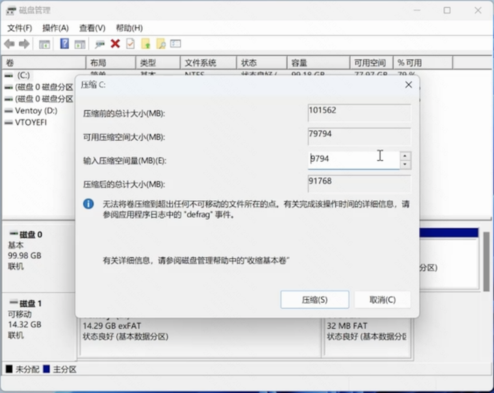

# Windows + Arch Linux 双系统安装

## 准备

### 下载镜像

Arch Linux 镜像：https://archlinux.org/download/

选择国内站点下载 iso 文件

### 制作启动盘

下载 Ventory：https://ventoy.net/cn/download.html

解压压缩包，打开应用程序；

选择 U 盘位置：


选择分区类型，这里选择 GPT：


点击安装（会格式化 U 盘，注意备份数据）：


将上一步下载的 Arch Linux 镜像文件，拷贝到 U 盘里。

Windows 搜索“格式化”，从多余的磁盘里新增一个分区，给 Arch Linux 使用（这里新增 150000MB）：



### U 盘启动

重启电脑，在启动界面，连续点按 F2 进入 BIOS 界面，在 Boot 菜单栏中关闭“安全启动”，按 F10 保存并退出。

退出后，选择 U 盘的 Arch Linux 进行启动。

## 安装

### 连接 WIFI

进入 iwctl 模式：`iwctl`

获取设备列表：`device list`

扫描设备：`station [device] scan`

获取设备所有网络：`station [device] get-networks`

连接网络：`station [device] connect [network-name]`，然后输入密码确认。

Ctrl + D 退出 iwctl 模式

测试网速：`ping www.baidu.com`

同步时间：`timedatectl set-ntp true`

### 分区

#### 初始化分区

获取磁盘列表信息：`fdisk -l`

配置磁盘：`cfdisk [device-name]`

可以看到磁盘内有之前新增的预留给 Arch Linux 的 150000MB 的空间，选中对应的行。

按 N 可以新增一个分区，这里我们新增四个分区：

1. EFI（100M, EFI System）：启动 Arch Linux 的引导程序
2. Swap（16G, Linux swp）：虚拟内存，预防断电导致数据丢失
3. Root（32G, Linux filesystem）：分配给 /root 的存储空间
4. Home（剩余, Linux home）：用户使用的存储空间

> 选择 type 修改分区类型，选择 write 保存分区

输入 `fdisk -l`，可以发现新增的分区已经生效。

#### 格式化分区

~~格式化引导分区：`mkfs.fat -F 32 [device-name]`~~（改成与 Windows 共用一个 EFI 分区，但只有 100M 容量，后面可能需要扩容）

格式化 Root 分区：`mkfs.ext4 [device-name]`

格式化 Home 分区：`mkfs.ext4 [device-name]`

格式化 Swap 分区：`mkswap [device-name]`

#### 挂载分区

挂载 Root 分区：`mount [device-name] /mnt`

挂载 Home 分区：`mount --mkdir [device-name] /mnt/home`

挂载引导分区：`mount --mkdir [device-name] /mnt/efi`

挂载 Swap 分区：`swapon [device-name]`

### 配置镜像源

配置镜像源：`vim /etc/pacman.d/mirrorlist`

在第一行添加清华镜像源：`Server = https://mirrors.tuna.tsinghua.edu.cn/archlinux/$repo/os/$arch`

刷新 Pacman：`pacman -Syy`

重新安装密钥：`pacman -S archlinux-keyring`

### 安装基本系统

安装软件：`pacstrap /mnt [package-name]`

安装的包：

- base（基础系统）
- base-devel（工具包）
- 系统内核 + 头文件：
  - linux + linux-headers（标准内核）
  - linux-lts + linux-lts-headers（长期支持内核）
  - linux-zen + linux-zen-headers（高性能内核，采用）
- linux-firmware（系统固件）
- networkmanager（网络管理）
- grub（引导程序）
- os-prober（多系统检测）
- efibootmgr（efi 启动项管理）
- ntfs-3g（ntfs 可读写）
- CPU 编码（根据硬件类型选择）：
  - amd-ucode
  - intel-ucode（采用）
- bluez（蓝牙）
- bluez-utils（蓝牙）
- vim（文本编辑器）

安装命令：`pacstrap /mnt base base-devel linux-zen linux-zen-headers linux-firmware networkmanager grub os-prober efibootmgr ntfs-3g intel-ucode bluez bluez-utils vim`

### 基本配置

创建 fstab（自动挂载配置文件）：`genfstab -U /mnt >> /mnt/etc/fstab`

进入系统：`arch-chroot /mnt`

设置时区：`ln -sf /usr/share/zoneinfo/Asia/Shanghai /etc/localtime`

设置硬件时间：`hwclock --systohc`

本地化：
locale.gen：字符集，locale.conf：语言环境

编辑 locale.gen：`vim /etc/locale.gen`，删除 `en_US.UTF-8 UTF-8` 和 `zh_CN.UTF-8 UTF-8` 前的 `#`

生成 locale：`locale-gen`

编辑 locale.conf：`vim /etc/locale.conf`，添加 `LANG=en_US.UTF-8`

设置主机名：`vim /etc/hostname`

设置 root 密码：`passwd`

创建普通用户：`useradd -m -G wheel [user-name]`

为用户创建密码：`passwd [user-name]`

编辑 sudoers 赋予用户 root 权限（用户可以通过 `sudo` 获取最高权限）：`vim /etc/sudoers`，删除 `%wheel ALL=(ALL:ALL) ALL` 前的 '#'

启用网络服务：`systemctl enable NetworkManager`

启用蓝牙服务：`systemctl enable bluetooth`

编辑 grub：`vim /etc/default/grub`，去掉 `GRUB_DISABLE_OS_PROBER=false` 前的 '#'

安装 grub 服务：`grub-install --target=x86_64-efi --efi-directory=/efi --bootloader-id=grub`

更新 grub 引导：`grub-mkconfig -o /boot/grub/grub.cfg`

### 安装桌面环境

安装 kde

- 简化安装：`pacman -S xorg plasma plasma-wayland-session`
- 完整安装：`pacman -S xorg plasma plasma-wayland-session kde-applications`

开机登录显示管理（指定 sddm 作为登录管理器）：`systemctl enable sddm`

如果 kde 是简化安装，则需要安装其他一些包：`pacman -S konsole dolphin ark kate`

> 因为简化安装缺少一些必要的东西：konsole（终端），dolphin（文件管理器），ark（解压缩软件），kate（文本编辑器）

退出系统：`exit`

重启：`reboot`

### 修改启动项

当重启之后，会发现直接进入了 Windows，没有走 grub 启动。

需要进入 BIOS，在 Boot 的优先级中，选择优先使用 grub 启动。

### 系统配置

#### 更细启动项

重启进入到 Arch Linux 启动页面，可以发现 grub 的启动选项里没有 Windows 这一选项，需要进入到系统后更新一下 grub 配置。

输入用户密码可以进入到 Arch Linux，打开 konsole 终端，执行更新命令：`sudo grub-mkconfig -o /boot/grub/grub.cfg`，可以发现结果已经有 Windows 的启动项。

#### 安装中文字体

安装中文字体，否则会乱码（需要先连接网络）：`sudo pacman -S adobe-source-han-sans-cn-fonts`

在设置里切换语言，然后重启，可以发现在启动项里已经有了 Windows 选项，进入到 Arch Linux，可以发现系统界面已经是中文了。

#### 配置安装源

配置国内源：`sudo vim /etc/pacman.conf`，

取消注释：`[multilib]` 和 `Include = /etc/pacman.d/mirrorlist`，

然后在下面添加其中任意一个源：

```
[archlinuxcn]
# 需要加上这行，不然安装会报错
SigLevel = Optional TrustAll

# 清华源
Server = https://mirrors.tuna.tsinghua.edu.cn/archlinuxcn/$arch

# 中科大源
Server = https://mirrors.ustc.edu.cn/archlinuxcn/$arch

# 华为源
Server = https://repo.huaweicloud.com/archlinux/$repo/os/$arch
```

添加成功后，刷新软件包：`sudo pacman -Syy`

然后，导入密钥：`sudo pacman -S archlinuxcn-keyring`

#### 安装应用程序

打开应用商店，可以发现一直在加载中，我们需要安装后端程序：`sudo pacman -S archlinux-appstream-data packagekit-qt5 fwupd`

安装完成后，打开应用商店，可以发现已经能正常使用了。

安装 aur 助手 yay：`sudo pacman -S yay`

yay 同步：`yay -Syy`

#### 安装中文输入法

> 参考：https://wiki.archlinuxcn.org/wiki/Fcitx5

安装软件包：`sudo pacman -S fcitx5 fcitx5-im fcitx-chinese-addons fcitx5-rime`

集成：`yay -S fcitx5-input-supportA`

## 系统备份

- timeshift rsync
- btrfs 和 zfs 的快照

## 参考教程

1. <iframe src="//player.bilibili.com/player.html?aid=745549831&bvid=BV1fk4y1w7wq&cid=1256430749&p=1" scrolling="no" border="0" frameborder="no" framespacing="0" allowfullscreen="true"> </iframe>

2. <iframe src="//player.bilibili.com/player.html?aid=81146687&bvid=BV11J411a7Tp&cid=138874808&p=1" scrolling="no" border="0" frameborder="no" framespacing="0" allowfullscreen="true"> </iframe>
